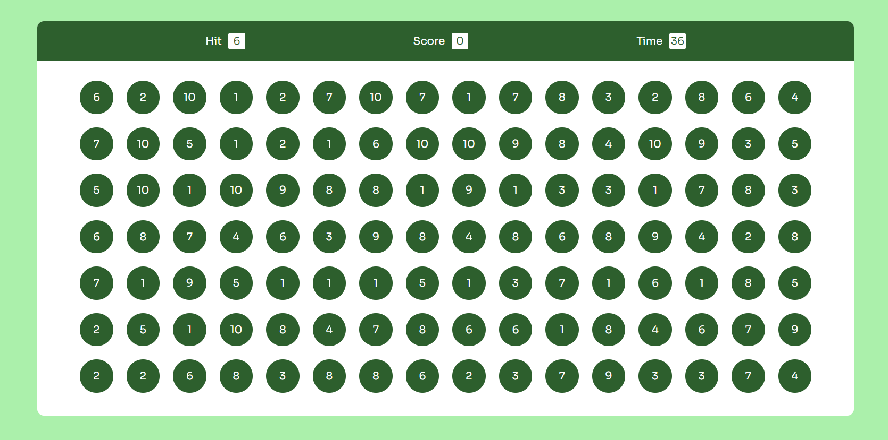

# Bubble-Game

## Description
Bubble Game is a simple browser-based game where players must click on bubbles to increase their score. Each bubble has a number inside, and players must click on the bubble with the same number as the target number displayed. The game ends when the timer runs out. Players aim to achieve the highest score possible within the given time.

## How to Play
2. **Click on Bubbles**: Click on bubbles with numbers matching the target number displayed at the top. Each correct click increases your score.
3. **Watch the Timer**: Keep an eye on the timer at the top. The game ends when the timer reaches zero.
4. **Score**: Your score is displayed on the screen. Try to beat your high score in subsequent rounds!

## Technologies Used
- HTML
- CSS
- JavaScript

## Features
- Randomly generated bubbles with numbers.
- Randomly generated target number.
- Timer countdown.
- Score tracking.
- End-of-game message displaying the final score.

## Preview

## How to Run
1. Clone the repository to your local machine.
2. Open `index.html` in your web browser.
3. Click on the "Start" button to begin playing the game.

## Credits
- Created by [Hmad Afzal]